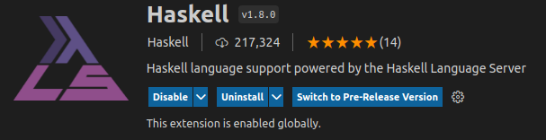

# set Up VSCode

> **_NOTE:_** for IDEs different than VSCode you can follow [the haskell language server readthedocs document](https://haskell-language-server.readthedocs.io/en/latest/installation.html)

in order to set up VSCode we'll need just a couple of extension;

first open vscode

then open the extension tab by clicking th following icon or by pressing ```Ctrl+Shift+X```


and install the ```Haskell Syntax Highlighting``` extension to add some colours to our ```.hs``` files


and then install the ```Haskell Language Server``` extension, which implements the features specified in the [Language Server Protocol](https://microsoft.github.io/language-server-protocol/), meaning that we'll have features like auto complete or documentation on hover in our ```.hs``` files

> **_NOTE:_** this extension needs to find ```ghc``` as aviable comand, meaning you should be able to call ```ghc``` from everywhere in your computer

